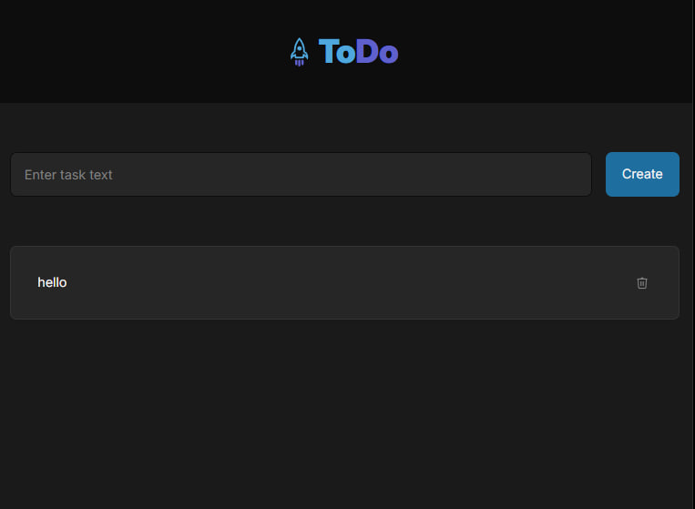

# Get-TODO

<p align="center">
  
</p>

> Навчальний проєкт у межах курсу [GoIT](https://goit.global/) — простий менеджер задач (todo-list) із синхронізацією на
> сервер через REST API.

🔗 **Жива версія:** [mrkorzun.github.io/Get-TODO](https://mrkorzun.github.io/Get-TODO/)

---

## 📌 Про проєкт

**Get-TODO** — це SPA-додаток для керування списком завдань. Користувач може створювати нові задачі та видаляти вже
непотрібні; усі зміни одразу відправляються на віддалений сервер ([MockAPI](https://mockapi.io/)), тож список
зберігається між сесіями.

Проєкт реалізовано у форматі **vanilla-додатку** (без UI-фреймворків) на базі шаблону із автоматичним деплоєм на GitHub
Pages через GitHub Actions.

## ✨ Функціонал

- ➕ **Створення задачі** — користувач вводить текст у поле форми та натискає `Create`. Задача відправляється на сервер
  (`POST /todo`) і одразу з'являється у списку.
- 🗑️ **Видалення задачі** — клік по іконці кошика біля задачі надсилає запит `DELETE /todo/:id`, після чого список
  перерендериться.
- ⏳ **Прелоадер** — під час завантаження списку з сервера показується індикатор завантаження.
- 🔔 **Тост-сповіщення** — користувач отримує інформативні повідомлення про успіх або помилку (через
  [iziToast](https://izitoast.marcelodolza.com/)).
- 🛡️ **Базова валідація** — порожнє поле не дозволяє створити задачу.
- 🔒 **Захист від подвійних запитів** — кнопка `Create` блокується на час відправки, поки сервер не дасть відповідь.

## 🛠️ Стек технологій

| Категорія        | Технологія                                     |
| ---------------- | ---------------------------------------------- |
| Мова             | JavaScript (ES6+ модулі)                       |
| Розмітка / стилі | HTML5, CSS3                                    |
| HTTP-клієнт      | [Axios](https://axios-http.com/)               |
| Сповіщення       | [iziToast](https://izitoast.marcelodolza.com/) |
| Бекенд           | [MockAPI](https://mockapi.io/) (REST API)      |
| Збирач           | [Vite](https://vitejs.dev/)                    |
| Хостинг          | GitHub Pages + GitHub Actions                  |

## 📂 Структура проєкту

```
Get-TODO/
├── .github/workflows/      # GitHub Actions: lint, build, deploy
├── assets/                 # Зображення для README
├── src/
│   ├── css/                # Стилі сторінки
│   ├── img/                # Зображення та SVG-спрайт icons.svg
│   ├── js/
│   │   ├── index.js            # Точка входу: підписка на події, оркестрація
│   │   ├── refs.js             # Кешовані посилання на DOM-елементи
│   │   ├── render-functions.js # Шаблон картки задачі
│   │   └── tasks-api.js        # HTTP-запити до сервера (axios)
│   └── partials/           # HTML-партіали: page-header, task-form, tasks-list
├── index.html              # Головна точка входу
├── package.json
└── vite.config.js
```

## 🌐 API

Запити виконуються через `axios` із базовим URL:

```
https://69f0a537c1533dbedc9d7348.mockapi.io
```

| Метод    | Endpoint    | Опис                    |
| -------- | ----------- | ----------------------- |
| `GET`    | `/todo`     | Отримати всі задачі     |
| `POST`   | `/todo`     | Створити нову задачу    |
| `DELETE` | `/todo/:id` | Видалити задачу за `id` |

Структура задачі, яку повертає сервер:

```js
{
  id: "1",
  text: "Купити каву"
}
```

## 🚀 Запуск локально

1. Переконайся, що встановлено LTS-версію [Node.js](https://nodejs.org/en/).
2. Клонуй репозиторій:
   ```bash
   git clone https://github.com/mrkorzun/Get-TODO.git
   cd Get-TODO
   ```
3. Встанови залежності:
   ```bash
   npm install
   ```
4. Запусти dev-сервер:
   ```bash
   npm run dev
   ```
5. Відкрий у браузері [http://localhost:5173](http://localhost:5173) — сторінка автоматично оновлюватиметься після
   збереження змін.

## 📦 Збірка продакшн-версії

```bash
npm run build
```

Готові файли з'являться у папці `dist/`.

## ☁️ Деплой

Продакшн-версія автоматично збирається й деплоїться на **GitHub Pages** (гілка `gh-pages`) щоразу, коли у `main`
приходить новий коміт. За весь процес (lint → build → deploy) відповідає workflow у `.github/workflows/deploy.yml`.

### Статус деплою

| Колір іконки | Що означає                                 |
| ------------ | ------------------------------------------ |
| 🟡 Жовтий    | Виконується збірка та деплой               |
| 🟢 Зелений   | Деплой завершено успішно                   |
| 🔴 Червоний  | Помилка під час лінтингу, збірки чи деплою |

## 👤 Автор

**mrkorzun**

- GitHub: [@mrkorzun](https://github.com/mrkorzun)

---

<sub>Проєкт створено в межах навчання у [GoIT](https://goit.global/) на базі офіційного
[vanilla-app-template](https://github.com/mrkorzun/vanilla-app-template).</sub>
